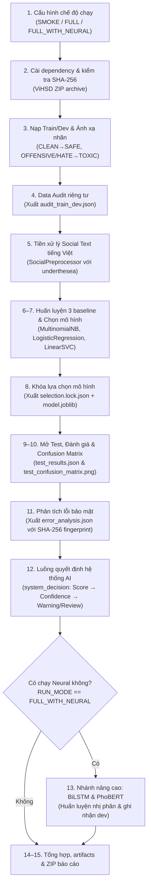

# CS106 - Đồ án Trí tuệ Nhân tạo: Phân loại Phát ngôn Độc hại Tiếng Việt (ViHSD)

[](https://colab.research.google.com/github/andrewthongle/cs106-ai-project/blob/main/tri_tue_nhan_tao.ipynb)
[](https://www.python.org/downloads/)
[](https://github.com/sonlam1102/vihsd)

Dự án môn học **Trí tuệ nhân tạo (CS106)** thực hiện bài toán sàng lọc phát ngôn độc hại tiếng Việt trên mạng xã hội dựa trên tập dữ liệu **ViHSD (Vietnamese Hate Speech Detection)**.

Logic tải dữ liệu, tiền xử lý, huấn luyện, đánh giá và tạo báo cáo nằm trong package Python [`vihsd_ai/`](vihsd_ai/). Notebook [`tri_tue_nhan_tao.ipynb`](tri_tue_nhan_tao.ipynb) dùng để đặt tham số, thử nghiệm và trình bày kết quả qua các lời gọi hàm ngắn.

**Kết quả đã chạy được giữ nguyên:** các bảng, log, biểu đồ và số thứ tự thực thi hiện có trong notebook là output của lần chạy trước khi tách code. Có thể mở notebook để xem/trình bày ngay, không cần cài dependency hay train lại. Chỉ chạy lại khi muốn tạo một thí nghiệm mới.

---

## 1. Cấu trúc Repository

Hiện tại repository được tổ chức tinh gọn:

```text
cs106-ai-project/
├── tri_tue_nhan_tao.ipynb    # Cấu hình, thực nghiệm và trình bày; giữ output đã chạy
├── vihsd_ai/
│   ├── config.py            # RunConfig, đường dẫn và ID riêng cho mỗi lần chạy
│   ├── data.py              # Tải/kiểm dữ liệu, đổi nhãn, lấy mẫu và audit
│   ├── preprocessing.py     # SocialPreprocessor dùng chung cho các mô hình
│   ├── metrics.py           # Metrics nhị phân và quy tắc xếp hạng dev
│   ├── baselines.py         # Train baseline, khóa lựa chọn và đánh giá test
│   ├── neural.py            # Train BiLSTM/PhoBERT, history và checkpoint
│   ├── analysis.py          # Thống kê lỗi và dự đoán câu demo
│   ├── reporting.py         # Bảng, biểu đồ, CSV/PNG và ZIP báo cáo
│   └── artifacts.py         # JSON, checksum và đọc checkpoint baseline
├── requirements.txt        # Dependency cho baseline/báo cáo
├── requirements-neural.txt  # Thêm dependency neural
└── README.md
```

> [!NOTE]
> Để giữ dung lượng repository nhẹ và sạch sẽ:
> - File dữ liệu (`vihsd.zip`) sẽ được notebook **tự động tải từ kho dữ liệu gốc và kiểm tra mã băm SHA-256** khi chạy.
> - Các file kết quả đánh giá (`.json`), biểu đồ ma trận nhầm lẫn (`.png`) và checkpoint mô hình (`.joblib`) sẽ được **tự động sinh ra trong thư mục output khi bạn bấm chạy notebook**.

---

## 2. Tổng quan bài toán & Phạm vi

### 2.1. Phân loại nhị phân trực tiếp
Hệ thống phân loại văn bản tiếng Việt thành 2 lớp:
- **`SAFE`**: Bình luận an toàn, chuẩn mực (ánh xạ từ nhãn `CLEAN` của ViHSD).
- **`TOXIC`**: Bình luận độc hại, xúc phạm hoặc thù ghét (ánh xạ gộp từ `OFFENSIVE` và `HATE`).

> [!IMPORTANT]
> **Quy tắc đổi nhãn trước khi huấn luyện (Remap Before Fit):**
> Việc gộp nhãn được thực hiện **ngay tại thời điểm nạp dữ liệu**, trước khi đưa vào bất kỳ mô hình nào. Các baseline cổ điển đều được huấn luyện trực tiếp như một bộ phân loại nhị phân (Binary Classifier), không phải huấn luyện 3 lớp rồi cộng gộp xác suất sau khi dự đoán.

### 2.2. Giới hạn phạm vi (Honesty of Scope)
- **Đặc trưng dữ liệu**: ViHSD chỉ chứa nội dung văn bản (`free_text`) và nhãn phân loại (`label_id`: 0, 1, 2). Không có dữ liệu thời gian (timestamp), mạng lưới tương tác (retweet/reply) hay nhãn kiểm chứng tin tức.
- **Tuyên bố tính năng**: Hệ thống chỉ đóng vai trò **sàng lọc ngôn từ độc hại (toxicity filtering)** nhằm hỗ trợ định tuyến đến con người kiểm duyệt (**Human-in-the-loop Review**); tuyệt đối không tuyên bố phát hiện tin giả (fake news) hay phân tích lan truyền mạng xã hội.
- **Bảo vệ quyền riêng tư**: Quá trình audit và phân tích lỗi chỉ ghi nhận các số liệu thống kê tổng hợp và chuỗi băm **SHA-256 fingerprint**; tuyệt đối không in (echo) bình luận độc hại thô ra màn hình.

---

## 3. Kiến trúc luồng thực thi & Giao thức chống rò rỉ dữ liệu

```text
train ──fit tiền xử lý, từ vựng, IDF + 3 mô hình──┐
                                                   ├─ xếp hạng trên dev (Macro-F1)
dev ───────────────────────────────────────────────┘
                         │
                         ▼
             selection.lock.json + SHA-256
                         │
                         ▼ (kích hoạt: CONFIRM_TEST_AFTER_LOCK=True)
test ───────────── chỉ mở cho baseline đã khóa; không fit lại ──► metrics test
```

1. **TF-IDF đóng gói trong Pipeline**: Bộ từ vựng và trọng số IDF chỉ được học trên tập `train`. Không bao giờ `fit` trên toàn bộ tập dữ liệu trước khi chia tách.
2. **Chọn baseline chỉ dùng tập `dev`**: Chọn trong 3 baseline theo **Macro-F1** giảm dần, tiếp theo là **TOXIC Recall** giảm dần và tên model để xử lý trường hợp bằng điểm. BiLSTM/PhoBERT được so sánh riêng trên dev, không thay thế baseline đã khóa.
3. **Cơ chế khóa trạng thái (`selection.lock.json`)**: Baseline thắng cuộc được lưu xuống đĩa (`.joblib`) và tính mã băm SHA-256. Tập `test` **chỉ được đọc sau khi đã khóa lựa chọn**; không dùng kết quả test để điều chỉnh hoặc chọn lại baseline.



---

## 4. Hướng dẫn chạy Notebook

### 4.1. Chạy trên Google Colab (Khuyến nghị)
1. Bấm vào huy hiệu [](https://colab.research.google.com/github/andrewthongle/cs106-ai-project/blob/main/tri_tue_nhan_tao.ipynb) để mở trực tiếp trên Colab bằng tài khoản Google của bạn.
   Notebook cần cả package `vihsd_ai/` và các file requirements cùng phiên bản. Cell thiết lập tự clone repo khi chưa có source. Nếu các thay đổi mới chưa được đẩy lên GitHub, upload checkout mới vào `/content/cs106-ai-project/` trước khi chạy; cell không tự ghi đè checkout đã tồn tại.
2. Tại **mục 1 — Cấu hình chế độ chạy**, bạn có thể tùy chỉnh biến `RUN_MODE`:
   * `"SMOKE"`: Chạy trên tập mẫu nhỏ để kiểm tra luồng tải dữ liệu, train, đánh giá và xuất báo cáo; không dùng để báo cáo chất lượng mô hình.
   * `"FULL"`: Chạy 3 baseline trên toàn bộ các split ViHSD theo giao thức train/dev/test ở trên. Thời gian phụ thuộc máy và môi trường.
   * `"FULL_WITH_NEURAL"`: Chạy toàn bộ dữ liệu kèm theo huấn luyện mô hình học sâu BiLSTM và fine-tune PhoBERT. Chọn GPU tại **Runtime** → **Change runtime type** → **T4 GPU**. Biến `NEURAL_EPOCHS` mặc định là 3; mỗi epoch đánh giá cả train/dev để vẽ đường học nên thời gian chạy phụ thuộc GPU và số epoch.
3. Bấm **Runtime** → **Run all** (hoặc tổ hợp phím `Ctrl + F9` / `Cmd + F9`).
4. Kết quả được lưu vào `/content/vihsd_ai_outputs/<run_id>/`. Notebook in đường dẫn cụ thể; mỗi lần khởi tạo tạo thư mục riêng để tránh trộn kết quả cũ. Sau khi hoàn tất, tải `reports.zip` từ bảng **Files** của Colab để lấy các file JSON/CSV/PNG báo cáo (không gồm checkpoint mô hình).

### 4.2. Chạy trên máy cục bộ (Local)
Yêu cầu môi trường: **Python 3.10+** và máy đã cài sẵn công cụ `git`.

1. Tạo môi trường ảo và kích hoạt:
   ```bash
   python3 -m venv .venv
   source .venv/bin/activate  # Trên Windows: .venv\Scripts\activate
   ```
2. Cài đặt các thư viện cần thiết:
   ```bash
   pip install -r requirements.txt
   pip install jupyterlab
   # Cài thêm nếu muốn chạy nhánh Deep Learning (BiLSTM / PhoBERT):
   pip install -r requirements-neural.txt
   ```
3. Khởi chạy Jupyter:
   ```bash
   jupyter lab tri_tue_nhan_tao.ipynb
   ```
4. Khi chạy trên máy local, các file artifact sẽ được tự động lưu vào thư mục: `outputs/notebook_run/<run_id>/`.

### 4.3. Thử nghiệm và tái sử dụng code Python

Trong notebook, chỉnh `RUN_MODE`, `SEED`, `NEURAL_EPOCHS`, dictionary `models`, learning rate của từng model neural hoặc danh sách `sample_sentences`. Sửa thuật toán ở file `.py` tương ứng. Sau khi sửa module, khởi động lại kernel và chạy từ đầu để tránh dùng code đã được Python cache.

Các bước nhận dữ liệu/trạng thái qua tham số và trả về kết quả riêng, không phụ thuộc biến toàn cục của notebook. Ví dụ chạy baseline trong một script đặt ở gốc repo:

```python
from vihsd_ai import RunConfig, create_run
from vihsd_ai.data import prepare_dataset, load_train_dev
from vihsd_ai.baselines import train_baselines, freeze_baseline, evaluate_test

run = create_run(RunConfig(run_mode="SMOKE", seed=42))
prepare_dataset(run)
train_df, dev_df = load_train_dev(run)
baselines = train_baselines(train_df, dev_df, seed=run.config.seed)
selection = freeze_baseline(run, baselines)
test = evaluate_test(run, confirm=True)
print(test.metrics)
```

`Reports(run)` trong `reporting.py` nhận các kết quả trên để vẽ và xuất báo cáo. Import module không tự tải dữ liệu hoặc huấn luyện; PyTorch/Transformers chỉ được nạp khi chạy nhánh neural. Hàm `load_baseline` hỗ trợ cả checkpoint mới và checkpoint cũ lưu `SocialPreprocessor` từ notebook.

---

## 5. Các artifacts tự động sinh ra khi chạy

Khi thực thi notebook, thư mục đầu ra sẽ tự động chứa các kết quả sau:

| Tên File | Định dạng | Nội dung mô tả |
|---|---|---|
| `manifest.json` | JSON | Thông số thực thi: Seed, Run mode, Commit & Checksum ViHSD, quy tắc ánh xạ nhãn. |
| `audit_train_dev.json` | JSON | Báo cáo kiểm tra dữ liệu: phân bố độ dài câu, tỷ lệ nhãn, số lượng URL, fingerprint. |
| `dev_results.json` | JSON | Bảng điểm chi tiết của cả 3 mô hình baseline trên tập Train và Dev. |
| `selection.lock.json` | JSON | Khóa trạng thái lựa chọn mô hình kèm mã băm SHA-256 trước khi mở test. |
| `<model_duoc_chon>.joblib` | Model | Toàn bộ pipeline baseline đã khóa: tiền xử lý, TF-IDF và classifier (ví dụ: `linear_svc.joblib`). |
| `test_results.json` | JSON | Kết quả đánh giá độc lập chính thức trên tập Test đã đóng băng. |
| `test_confusion_matrix.png` | Ảnh PNG | Biểu đồ ma trận nhầm lẫn thể hiện phân bố dự đoán đúng/sai trên tập Test. |
| `error_analysis.json` | JSON | Báo cáo phân loại sai (False Positive / False Negative) kèm fingerprint SHA-256. |
| `neural_results.json` | JSON | *(Khi bật `FULL_WITH_NEURAL`)* Metrics train/dev tại epoch tốt nhất, thời gian, cấu hình và trạng thái nhánh neural. |
| `bilstm_binary.best.pt` | Checkpoint | *(Khi bật `FULL_WITH_NEURAL`)* Trọng số BiLSTM tốt nhất, từ vựng, nhãn và epoch đã chọn. |
| `phobert_binary.best/` | Thư mục model | *(Khi bật `FULL_WITH_NEURAL`)* Model PhoBERT tốt nhất, cấu hình và tokenizer; cần giữ toàn bộ thư mục. |
| `neural_history.json`, `neural_history.csv` | JSON/CSV | Loss tối ưu, loss/metrics train và dev, thời gian từng epoch; được lưu sau mỗi epoch. |
| `*_summary.csv`, `*_per_class.csv` | CSV | Metrics tổng hợp và Precision/Recall/F1/Support từng lớp của baseline, test và neural. |
| `*_learning_curves.png`, `*_confusions.png` | PNG | Đường học với epoch tốt nhất; confusion matrix số lượng và tỷ lệ theo nhãn thật. |
| `all_models_dev_leaderboard.*`, `all_models_comparison.png` | JSON/CSV/PNG | So sánh các mô hình trên cùng tập dev, khoảng cách train–dev và thời gian fit. |
| `test_error_*.csv`, `test_errors_by_length.csv`, `test_error_analysis.png` | CSV/PNG | Lỗi FP/FN, tỷ lệ với mẫu số, lỗi theo độ dài và fingerprint của tối đa 20 lỗi đầu tiên. |
| `demo_predictions.*` | JSON/CSV/PNG | Demo bằng câu tự tạo, tên model, confidence proxy, cảnh báo và human review. |
| `artifact_inventory.csv`, `reports.zip` | CSV/ZIP | Danh sách artifacts và gói JSON/CSV/PNG của lần chạy. |

Notebook hiển thị đầy đủ các hàng/cột và nội dung câu demo; bảng lớn có thể cuộn. Biểu đồ đều được lưu thành PNG. Các metrics lưu trong JSON/CSV giữ độ chính xác gốc, chỉ định dạng làm tròn khi hiển thị.

**Phân biệt dev với test:** bảng so sánh có đủ 5 mô hình khi chạy `FULL_WITH_NEURAL`, nhưng test và demo vẫn dùng baseline đã khóa trước đó. BiLSTM/PhoBERT chỉ đánh giá trên train/dev. `confidence_proxy` trong demo chưa phải xác suất đúng đã hiệu chỉnh.

### Lưu kết quả từ Colab về máy

- **Để viết báo cáo/trình bày:** giữ notebook có output và tải `reports.zip`. ZIP chứa JSON/CSV/PNG báo cáo ở cấp gốc của thư mục lần chạy.
- **Để dùng lại mô hình mà không train lại:** tải thêm `<model_duoc_chon>.joblib`, `bilstm_binary.best.pt` và toàn bộ `phobert_binary.best/` nếu đã chạy neural. Những checkpoint này không nằm trong `reports.zip`.
- **Để lưu trọn bộ lần chạy:** nén và tải cả thư mục `/content/vihsd_ai_outputs/<run_id>/`, đồng thời giữ phiên bản source tương ứng. Tải về trước khi runtime Colab bị xóa.

---

## 6. Xử lý sự cố thường gặp (Troubleshooting)

* **Lỗi khi cài `underthesea`:** Thư viện được ghim vào một Git commit cụ thể để đảm bảo tính tái lập. Nếu chạy trên máy local, hãy chắc chắn máy đã cài `git` và lệnh `git --version` chạy được trong Terminal. (Trên Google Colab, `git` đã có sẵn mặc định).
* **Lỗi `AssertionError: Review dev selection then explicitly confirm test`:** Đây là chốt chặn an toàn nhằm ngăn ngừa việc vô tình mở tập Test trước khi xem xét kỹ tập Dev. Hãy đảm bảo biến `CONFIRM_TEST_AFTER_LOCK = True` tại mục 1 — Cấu hình chế độ chạy.
* **Huấn luyện mô hình Deep Learning bị chậm:** Dùng GPU trên Colab. Notebook in tiến độ theo batch và kết quả từng epoch, đồng thời lưu lịch sử sau mỗi epoch; việc đánh giá toàn bộ train/dev sau mỗi epoch làm tăng thời gian chạy.
