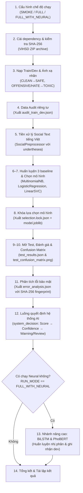

# CS106 - Đồ án Trí tuệ Nhân tạo: Phân loại Phát ngôn Độc hại Tiếng Việt (ViHSD)

[](https://colab.research.google.com/github/andrewthongle/cs106-ai-project/blob/main/tri_tue_nhan_tao.ipynb)
[](https://www.python.org/downloads/)
[](https://github.com/sonlam1102/vihsd)

Tài liệu kỹ thuật và hướng dẫn thực thi dành cho đồ án môn **Trí tuệ nhân tạo (CS106)**. Đồ án giải quyết bài toán sàng lọc nội dung mạng xã hội tiếng Việt dựa trên tập dữ liệu **ViHSD (Vietnamese Hate Speech Detection)**, được xây dựng hoàn toàn khép kín trong notebook [`tri_tue_nhan_tao.ipynb`](tri_tue_nhan_tao.ipynb).

---

## 1. Giới thiệu tổng quan & Mục tiêu bài toán

### 1.1. Bài toán chính
Notebook giải quyết bài toán **phân loại trực tiếp nhị phân (Binary Classification)** để sàng lọc nội dung văn bản tiếng Việt trên mạng xã hội:
- **`SAFE`**: Nội dung an toàn, chuẩn mực (ánh xạ từ nhãn gốc `CLEAN`).
- **`TOXIC`**: Nội dung độc hại, xúc phạm hoặc thù ghét (ánh xạ gộp từ nhãn gốc `OFFENSIVE` và `HATE`).

> [!IMPORTANT]
> **Quy tắc đổi nhãn trước khi huấn luyện (Remap Before Fit):**
> Nhãn được ánh xạ sang nhị phân **ngay tại thời điểm nạp dữ liệu**, trước khi đưa vào bất kỳ mô hình nào. Ba baseline cổ điển (`MultinomialNB`, `LogisticRegression`, `LinearSVC`) đều được khởi tạo và huấn luyện như các bộ phân loại nhị phân thực thụ, **không phải** huấn luyện 3 lớp rồi gộp xác suất sau khi dự đoán.

### 1.2. Phạm vi trung thực (Honesty of Scope)
- **Tập dữ liệu sử dụng**: ViHSD (Vietnamese Hate Speech Detection). Dữ liệu chỉ chứa nhãn phân loại phát ngôn độc hại (`label_id`: 0, 1, 2) và nội dung văn bản (`free_text`).
- **Giới hạn phạm vi**: Dữ liệu **hoàn toàn không có** nhãn kiểm chứng tin thật/tin giả, không có thông tin thời gian (timestamp), đồ thị tương tác (reply/retweet/share). Do đó, hệ thống chỉ tuyên bố tính năng **sàng lọc ngôn từ độc hại (toxicity filtering)**, tuyệt đối không tuyên bố phát hiện tin giả (fake news detection) hay phân tích lan truyền mạng xã hội.
- **Vai trò trong thực tế**: Kết quả dự đoán đóng vai trò là tín hiệu cảnh báo ban đầu, hỗ trợ định tuyến đến **con người kiểm duyệt (Human-in-the-loop Review)**; không dùng để tự động ban hành quyết định xử phạt người dùng.

---

## 2. Triết lý thiết kế & Giao thức chống rò rỉ dữ liệu

Notebook được xây dựng tuân thủ nghiêm ngặt chuẩn mực kỹ nghệ Machine Learning:

### 2.1. Tính chất tự chứa (Self-contained)
Notebook chứa đầy đủ 100% mã nguồn thực thi từ cài đặt thư viện, nạp dữ liệu, tiền xử lý, huấn luyện, đánh giá đến xuất artifact:
- Không import mã nguồn bên ngoài.
- Không sử dụng các lệnh magic `%run`, không phụ thuộc script phụ trợ.
- Có thể chạy 1-click độc lập trên **Google Colab** hoặc môi trường **Jupyter** cục bộ.

### 2.2. Giao thức chống rò rỉ dữ liệu (Strict Anti-leakage Protocol)

```text
train ──fit tiền xử lý, từ vựng, IDF + 3 mô hình──┐
                                                   ├─ xếp hạng trên dev (Macro-F1)
dev ───────────────────────────────────────────────┘
                         │
                         ▼
             selection.lock.json + SHA-256
                         │
                         ▼ (kích hoạt: CONFIRM_TEST_AFTER_LOCK=True)
test ───────────── chỉ mở cho mô hình thắng cuộc; không fit lại ──► metrics chính thức
```

1. **TF-IDF nằm trong scikit-learn `Pipeline`**: Bộ từ vựng và trọng số IDF chỉ được học trên tập `train`. Tuyệt đối không `fit` vectorizer trên toàn bộ dữ liệu trước khi chia split.
2. **Chọn mô hình chỉ dùng tập `dev`**: 
   - Tiêu chí chính: **Dev Macro-F1** (phù hợp với dữ liệu mất cân bằng lớp).
   - Tiêu chí phụ (tie-breaker): **Dev TOXIC Recall** (ưu tiên độ phủ đối với mẫu độc hại).
3. **Cơ chế khóa trạng thái (`selection.lock.json`)**:
   - Khi mô hình tốt nhất được chọn, pipeline được lưu xuống file `.joblib`, tính mã băm SHA-256 và ghi vào file lock.
   - Tập `test` bị cô lập hoàn toàn và **chỉ được đọc sau khi đã khóa lựa chọn**.
   - Nếu phát hiện file lock bị sửa đổi, hash không khớp hoặc cờ xác nhận chưa bật, notebook sẽ dừng ngay lập tức.
   - Tuyệt đối không điều chỉnh siêu tham số (hyperparameter) hay chọn lại mô hình sau khi đã nhìn thấy kết quả `test`.

### 2.3. Quy chuẩn bảo vệ quyền riêng tư (Privacy-safe by Design)
- Tuyệt đối không in (echo) các dòng bình luận thô (raw comments) độc hại ra màn hình notebook hoặc các file báo cáo.
- Dữ liệu báo cáo và phân tích lỗi chỉ lưu trữ các số liệu tổng hợp (aggregate distribution) và chuỗi băm **SHA-256 fingerprint** có tiền tố phân tách miền:
  $$\text{fingerprint} = \text{SHA-256}(\texttt{"vihsd-ai-notebook-v1\textbackslash 0"} + \text{text})$$

---

## 3. Kiến trúc luồng thực thi trong Notebook



---

## 4. Hướng dẫn chạy Notebook

### 4.1. Chạy trên Google Colab (Khuyến nghị)
1. Nhấn nút [](https://colab.research.google.com/github/andrewthongle/cs106-ai-project/blob/main/tri_tue_nhan_tao.ipynb) để mở trực tiếp trên Colab.
2. Nếu muốn chạy nhánh Deep Learning (`FULL_WITH_NEURAL`), vào menu: **Runtime** → **Change runtime type** → chọn **T4 GPU**.
3. Tại **Cell 1**, chọn cấu hình `RUN_MODE`:
   - `"SMOKE"`: Chạy thử nhanh (~15 giây) để kiểm tra luồng code không lỗi.
   - `"FULL"`: Chạy chính thức toàn bộ dữ liệu (~3 phút trên CPU).
   - `"FULL_WITH_NEURAL"`: Chạy toàn bộ dữ liệu + huấn luyện BiLSTM và PhoBERT (~15-20 phút với GPU).
4. Nhấn **Runtime** → **Run all** (hoặc `Ctrl + F9` / `Cmd + F9`).
5. Kết quả và artifacts sẽ tự động được lưu vào thư mục `/content/vihsd_ai_outputs`.

### 4.2. Chạy trên máy Local (VS Code / Jupyter Lab)
Yêu cầu môi trường: **Python 3.10+** và máy có cài sẵn `git` (để cài đặt `underthesea` từ Git commit).

1. Khởi tạo môi trường ảo và kích hoạt:
   ```bash
   python3 -m venv .venv
   source .venv/bin/activate  # Trên Windows: .venv\Scripts\activate
   ```
2. Cài đặt các thư viện phụ thuộc:
   ```bash
   pip install pandas scikit-learn joblib matplotlib pyyaml ipywidgets jupyterlab
   pip install "huggingface-hub>=0.34,<1"
   pip install "underthesea @ git+https://github.com/undertheseanlp/underthesea.git@3f5a619799c61d630bb4eb622c048d8cfdce5e76"
   # Nếu muốn chạy nhánh Neural (BiLSTM/PhoBERT):
   pip install torch transformers accelerate
   ```
3. Khởi động Jupyter:
   ```bash
   jupyter lab tri_tue_nhan_tao.ipynb
   ```
4. Khi chạy local, các artifact sinh ra sẽ nằm tại thư mục: `outputs/notebook_run/`.

---

## 5. Phân tích chi tiết từng Section trong Notebook

| Section | Nội dung & Chức năng cốt lõi |
|---|---|
| **Section 1: Cấu hình chạy** | Khai báo `RUN_MODE` (`SMOKE`, `FULL`, `FULL_WITH_NEURAL`), cố định `SEED = 42`, và cờ `CONFIRM_TEST_AFTER_LOCK = True`. |
| **Section 2: Cài đặt & Checksum** | Tự động cài package với exact commit; tải `vihsd.zip` từ GitHub tác giả và kiểm tra SHA-256 (`1d823c4c86a8...`) trước khi nạp. |
| **Section 3: Nạp dữ liệu & Đổi nhãn** | Đọc stream ZIP trực tiếp; ánh xạ `CLEAN → SAFE`, `OFFENSIVE/HATE → TOXIC` ngay khi nạp (Remap Before Fit). |
| **Section 4: Data Audit riêng tư** | Thống kê phân bố độ dài văn bản, tỷ lệ URL, số fingerprint SHA-256 duy nhất; xuất `audit_train_dev.json`. |
| **Section 5: Tiền xử lý tiếng Việt** | Class `SocialPreprocessor` (Unicode NFC, lower, ẩn danh URL, biểu cảm/emoji, ký tự kéo dài, teen code, tách từ `underthesea`, lọc stopword giữ từ phủ định). |
| **Section 6–7: Huấn luyện Baseline** | Huấn luyện 3 mô hình (`MultinomialNB`, `LogisticRegression`, `LinearSVC`) trong scikit-learn Pipeline; chọn mô hình thắng cuộc trên Dev (ưu tiên Macro-F1 $\to$ TOXIC Recall). |
| **Section 8: Khóa lựa chọn mô hình** | Đóng gói mô hình thắng cuộc thành `.joblib`, xuất `dev_results.json`, `manifest.json`, và khóa SHA-256 vào `selection.lock.json`. |
| **Section 9–10: Đánh giá Test & Ma trận** | Kiểm tra file lock nguyên vẹn $\to$ mở tập test $\to$ suy luận (no refit) $\to$ xuất `test_results.json` và biểu đồ `test_confusion_matrix.png`. |
| **Section 11: Phân tích lỗi bảo mật** | Thống kê FP/FN; lưu tiền tố SHA-256 fingerprint (không in text thô) $\to$ xuất `error_analysis.json`. |
| **Section 12: Luồng quyết định AI** | Hàm `system_decision`: Chuyển score sang xác suất Sigmoid (với LinearSVC), phân cấp cảnh báo (`HIGH`, `MEDIUM`, `REVIEW`, `LOW`) và gắn cờ Human Review. |
| **Section 13: Nhánh Deep Learning** | *(Tùy chọn)* Huấn luyện BiLSTM (PyTorch) và fine-tune `vinai/phobert-base-v2` (Transformers); đánh giá trên dev $\to$ `neural_results.json`. |
| **Section 14: Tái lập & Kết luận** | Tổng kết bộ artifact và khẳng định tính tái lập độc lập của thực nghiệm. |

---

## 6. Danh mục Artifacts đầu ra

Sau khi chạy xong notebook, thư mục đầu ra (`/content/vihsd_ai_outputs` trên Colab hoặc `outputs/notebook_run` trên Local) sẽ chứa các artifacts:

| Tên File | Định dạng | Mục đích & Nội dung |
|---|---|---|
| `manifest.json` | JSON | Metadata thực thi: Seed, Run mode, Commit & Checksum tập dữ liệu, ánh xạ nhãn trước khi fit. |
| `audit_train_dev.json` | JSON | Báo cáo kiểm tra chất lượng dữ liệu: phân bố độ dài câu, tỷ lệ nhãn, số lượng URL. |
| `dev_results.json` | JSON | Bảng điểm chi tiết của 3 mô hình baseline trên Train và Dev; mô hình được chọn. |
| `selection.lock.json` | JSON | Khóa lựa chọn mô hình, lưu kèm mã SHA-256 của file artifact và dev results. |
| `<selected_model>.joblib` | Nhị phân | Mô hình chiến thắng (ví dụ: `linear_svc.joblib` hoặc `logistic_regression.joblib`). |
| `test_results.json` | JSON | Kết quả kiểm thử chính thức trên tập Test đã đóng băng (chỉ xuất hiện sau khi khóa). |
| `test_confusion_matrix.png` | Ảnh PNG | Biểu đồ ma trận nhầm lẫn 2x2 thể hiện rõ số lượng True/False Positive và Negative. |
| `error_analysis.json` | JSON | Báo cáo thống kê lỗi phân loại và danh sách tiền tố SHA-256 fingerprint. |
| `neural_results.json` | JSON | *(Chỉ có khi bật `FULL_WITH_NEURAL`)* Kết quả đánh giá Dev của BiLSTM và PhoBERT. |
| `bilstm_binary.best.pt` | PyTorch model | *(Chỉ có khi bật `FULL_WITH_NEURAL`)* Trọng số checkpoint tốt nhất của BiLSTM. |
| `phobert_binary.best/` | Thư mục | *(Chỉ có khi bật `FULL_WITH_NEURAL`)* Checkpoint mô hình và tokenizer của PhoBERT. |

---

## 7. Cấu trúc thư mục Repository

```text
cs106-ai-project/
├── README.md                 # Tài liệu tổng quan, hướng dẫn kỹ thuật & báo cáo đồ án
├── tri_tue_nhan_tao.ipynb    # Notebook tự chứa 100% (chạy độc lập trên Colab / Local)
└── outputs/notebook_run/     # Thư mục chứa artifacts đầu ra khi chạy trên máy local (tự sinh)
```

---

## 8. Các câu hỏi thường gặp & Xử lý lỗi (FAQs)

### Q1: Lỗi khi cài `underthesea` trên Colab hoặc máy local?
- **Nguyên nhân**: `underthesea` được pin vào Git commit cụ thể (`@git+https://...`). Nếu môi trường máy tính chưa có công cụ `git`, lệnh `pip install` sẽ thất bại.
- **Khắc phục**: 
  - Trên Colab: Git đã có sẵn mặc định, không cần thao tác thêm.
  - Trên máy cá nhân: Cài đặt `git` và đảm bảo câu lệnh `git --version` chạy được trong Terminal.

### Q2: Tại sao gặp lỗi `AssertionError: Review dev selection then explicitly confirm test`?
- **Nguyên nhân**: Bạn chưa bật cờ xác nhận mở test. Đây là chốt chặn an toàn nhằm ngăn ngừa việc vô tình nhìn thấy tập `test` trước khi xem xét kỹ kết quả trên tập `dev`.
- **Khắc phục**: Đảm bảo biến `CONFIRM_TEST_AFTER_LOCK = True` trong cấu hình ở đầu notebook.

### Q3: Sự khác biệt giữa `LinearSVC` và `LogisticRegression` trong bài toán này?
- Trên tập `dev` đầy đủ (seed 42):
  - `LinearSVC` thường đạt Macro-F1 nhỉnh hơn một chút (~0.7923 so với 0.7911).
  - `LogisticRegression` lại có TOXIC Recall cao hơn (~0.7656 so với 0.7241).
- Do quy tắc tuyển chọn trong notebook ưu tiên Macro-F1 trước tiên, nên `LinearSVC` được chọn để khóa mở test. Nếu trong thực tế muốn tối đa hóa khả năng bắt lỗi độc hại, `LogisticRegression` cũng là một ứng viên rất mạnh.

### Q4: Có thể chạy `FULL_WITH_NEURAL` trên máy cá nhân không có GPU không?
- Bạn có thể chạy được, nhưng quá trình fine-tuning PhoBERT trên CPU sẽ rất chậm.
- **Khuyến nghị**: Hãy mở notebook trên Google Colab và kích hoạt GPU miễn phí (T4 GPU) để chạy chỉ trong khoảng 15–20 phút.

---

## 9. Checklist kiểm tra trước khi bàn giao / thuyết trình

- [ ] Đã chạy thử ít nhất 1 lần ở chế độ `SMOKE` để kiểm tra luồng code không có lỗi cú pháp.
- [ ] Đã chạy hoàn tất ở chế độ `FULL` để tạo bộ artifact chính thức.
- [ ] Thư mục output đã có đầy đủ: `manifest.json`, `dev_results.json`, `selection.lock.json`, `test_results.json`, `test_confusion_matrix.png`, `error_analysis.json`.
- [ ] Hiểu rõ và giải thích được nguyên tắc: *"Tại sao ánh xạ nhãn sang SAFE/TOXIC trước khi fit?"*.
- [ ] Hiểu rõ cơ chế khóa: *"Tại sao phải khóa mô hình bằng SHA-256 trước khi mở tập test?"*.
- [ ] Nắm được cách thức hàm `system_decision` tính độ tin cậy và định tuyến đến Human Review.